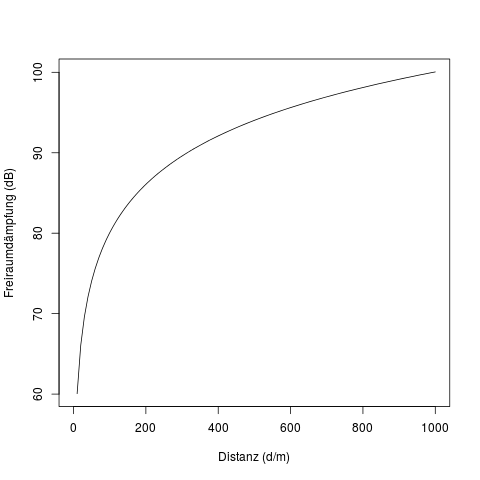
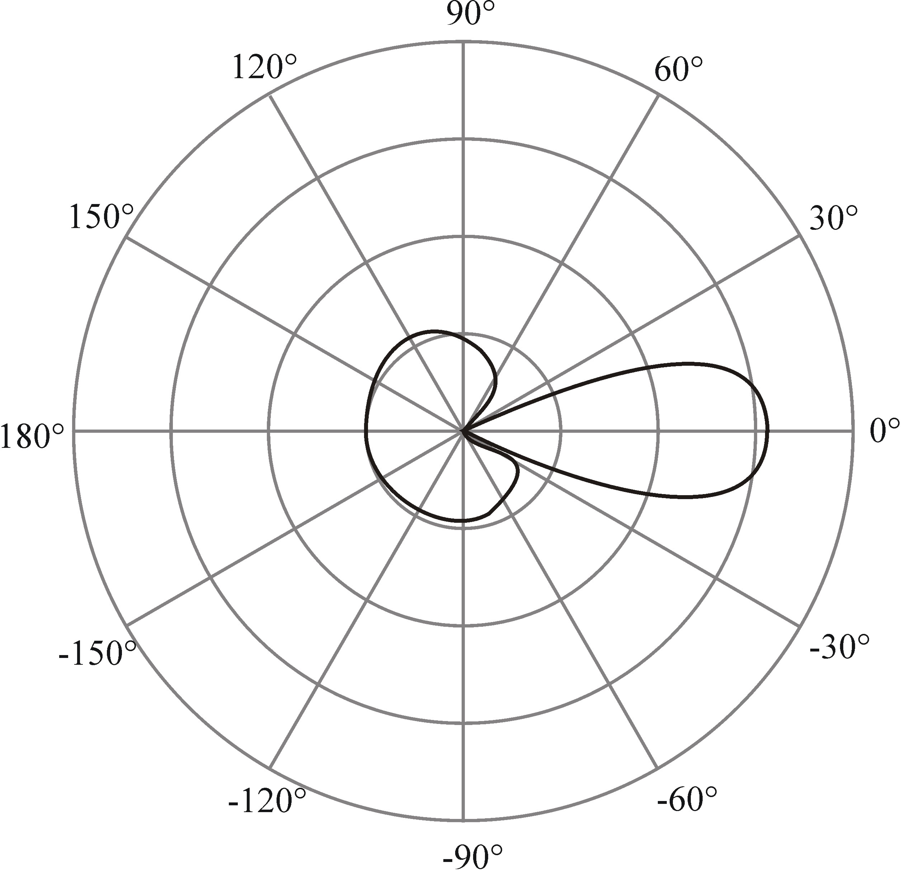
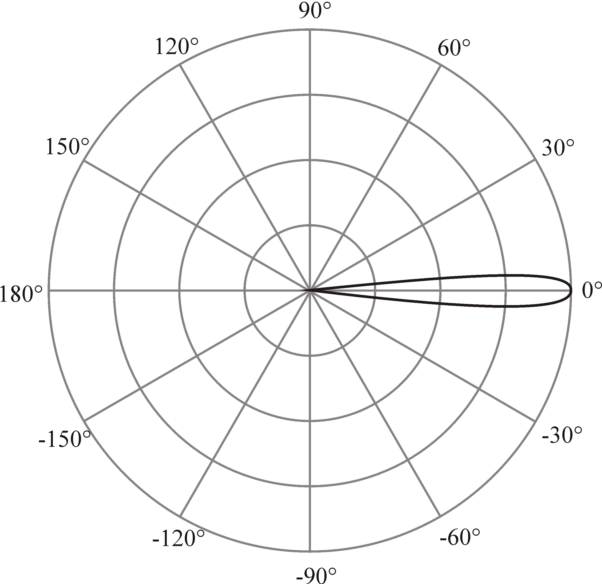
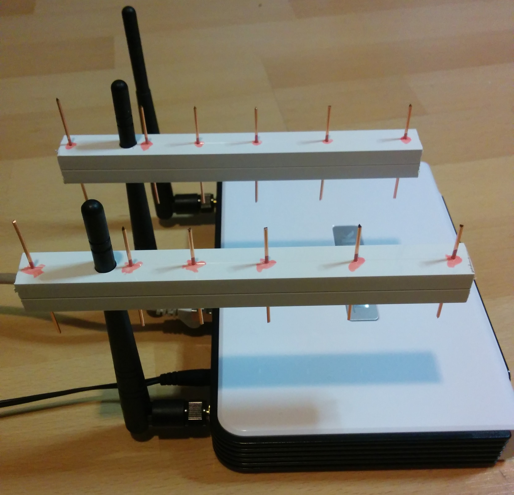
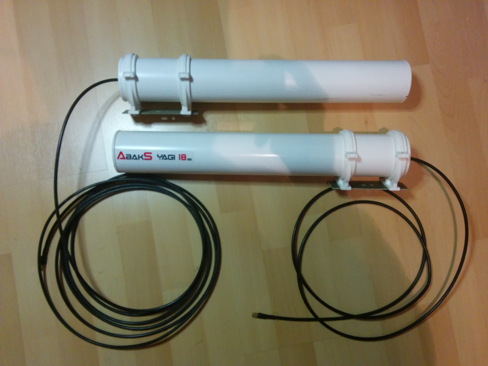
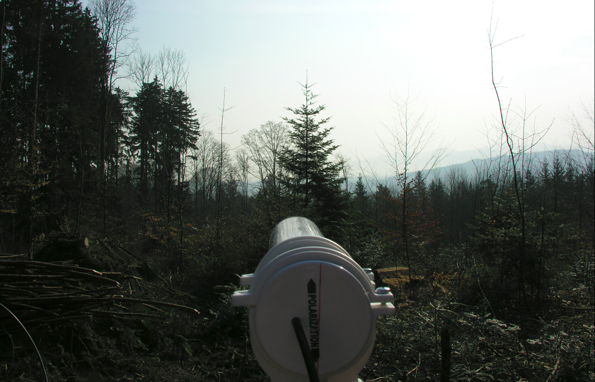
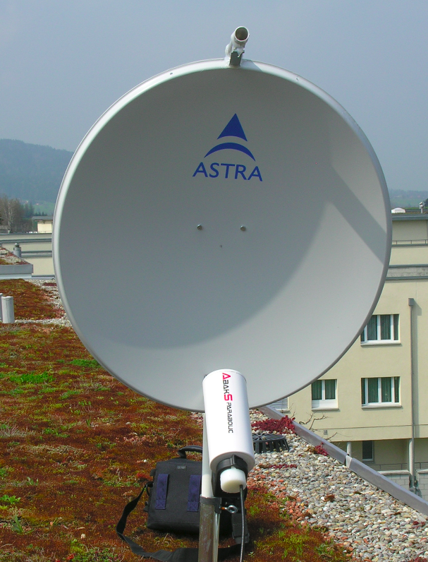
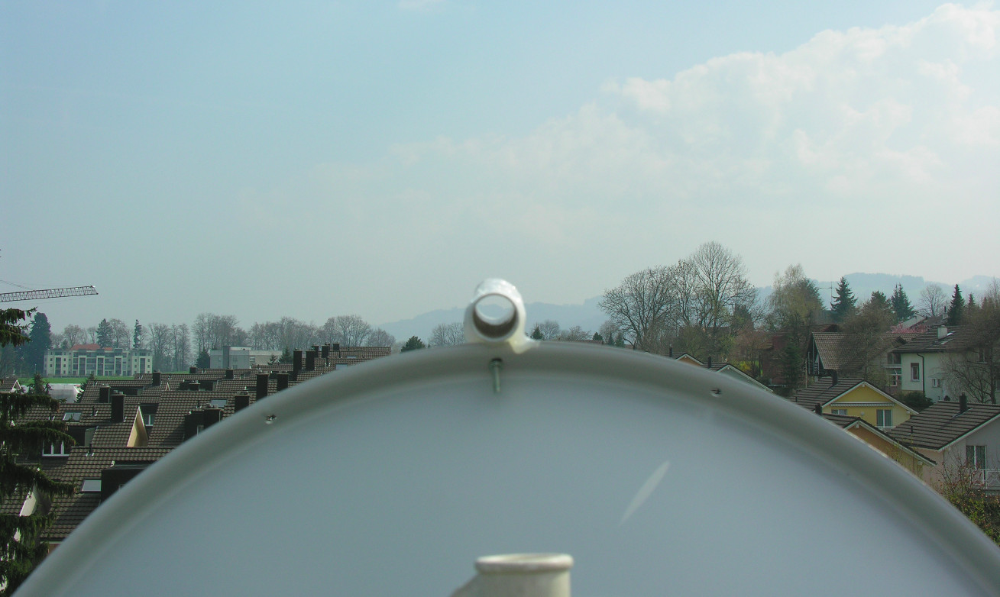

## Aufgabenstellung
<!-- Wichtigstes hervorheben? -->
WLAN über grosse Distanzen

# Begriffe
> + Freiraumdämpfung
> + dB/dBm/dBi/mW 
> + Antenne/AP
> + Ausgangsleistung

# Vorgehensweise
> + read
> + understand
> + read again
> + try it
> + buy professional stuff
> + try again

# Story

## 

## 

## 

#

## 

## 

## 

## 

## 

#

## Fragen